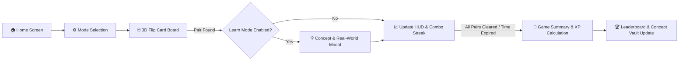

# 🧠 DATAMIND — Data Science Learning Game

<p align="center">
  
  
  
  
  
</p>

<p align="center">
  <b>DATAMIND</b> is an interactive, gamified educational memory-matching game designed to help learners, students, and engineers master foundational to advanced Data Science, Machine Learning, and Analytics concepts through active recall and spaced recognition.
</p>

---

## 📑 Table of Contents

- [✨ Key Features](#-key-features)
- [🎮 Game Modes & Topics](#-game-modes--topics)
- [⚡ Game Flow & Mechanics](#-game-flow--mechanics)
- [📈 Scoring, XP & Progression System](#-scoring-xp--progression-system)
- [🏆 Achievements Engine](#-achievements-engine)
- [📚 Concept Vault (Knowledge Hub)](#-concept-vault-knowledge-hub)
- [📊 Leaderboard & Analytics](#-leaderboard--analytics)
- [🎨 Design System & Accessibility](#-design-system--accessibility)
- [🔊 Programmatic Audio Engine](#-programmatic-audio-engine)
- [📂 Project Architecture](#-project-architecture)
- [🚀 Getting Started](#-getting-started)
- [💾 Data Storage & Persistence](#-data-storage--persistence)
- [🤝 Contributing](#-contributing)
- [📄 License](#-license)

---

## ✨ Key Features

- **🧠 Deep Pedagogical Focus**: Every match reinforces learning with real-world industry examples, definitions, and memory tips.
- **⚡ 100% Vanilla Tech Stack**: Built entirely with HTML5, CSS3, and ES6+ modules. Zero build steps, zero npm dependencies, zero bundle overhead.
- **📅 Daily Challenge Mode**: Generates a unique daily game seed with bonus XP awards and special achievement tracking.
- **📖 Concept Vault**: Built-in interactive concept dictionary tracking strong vs. weak concepts based on real gameplay accuracy.
- **🎵 Synthetic Web Audio Engine**: All 7 sound effects (flips, hints, combos, victory fanfare, timer warnings) synthesized at runtime via the Web Audio API — no audio asset downloads required.
- **🌓 Dual Theme Engine**: Seamless toggle between clean light mode and high-contrast dark mode with persistent user preferences.
- **📱 Fully Responsive & Accessible**: 3D card flips, keyboard navigation (`Tab` / `Enter` / `Space`), `:focus-visible` outlines, and `prefers-reduced-motion` compliance.

---

## 🎮 Game Modes & Topics

DATAMIND includes **5 comprehensive topic categories**, featuring **60 distinct term/definition pairs** paired with real-world examples:

| Topic | Category | Description | Sample Concepts |
|---|---|---|---|
| **Data Science Basics** | `dataBasics` | Foundational terminology and core data concepts | *Data, Information, Dataset, Feature, Label, Algorithm, Big Data, Metadata* |
| **Python Libraries** | `pythonLibraries` | Tooling & ecosystem across data engineering & ML | *Pandas, NumPy, Matplotlib, Scikit-learn, Seaborn, PyTorch, TensorFlow, SciPy* |
| **Data Science Workflow** | `workflow` | End-to-end lifecycle of data science initiatives | *Data Cleaning, Feature Engineering, Model Training, Evaluation, Deployment* |
| **Statistics & Math** | `statistics` | Essential statistical measures and distributions | *Mean, Median, Standard Deviation, Variance, Correlation, Regression, Outlier* |
| **Data Careers** | `careers` | Industry roles and functional responsibilities | *Data Analyst, Data Scientist, ML Engineer, BI Developer, Data Architect* |

### Difficulty Modes

- 🟢 **Easy (4 Pairs / 8 Cards)**: Ideal for quick review and beginner practice.
- 🟡 **Medium (8 Pairs / 16 Cards)**: Standard challenge mode requiring focus and spatial memory.
- 🔴 **Hard (12 Pairs / 24 Cards)**: Complete topic challenge testing comprehensive mastery.

### Timer Configurations

- ⏳ **No Timer**: Relaxed, untimed learning experience.
- ⏱️ **60 Seconds**: High-pressure speedrun format.
- ⏱️ **90 Seconds**: Balanced countdown with audio-visual urgency cues under 10 seconds.

---

## ⚡ Game Flow & Mechanics



1. **Topic Selection**: Select one of the 5 data science topics or jump into the **Daily Challenge**.
2. **Mode Customization**: Configure difficulty, timer limit, hint availability, and Learn Mode toggle.
3. **Interactive Match Board**: Cards feature 3D flip animation (`preserve-3d`). Flipping matching term ↔ definition pairs triggers visual confirmations and combo streaks.
4. **Learn Mode Interstitial**: When enabled, matching a pair presents a detailed breakdown explaining:
   - **Clear Definition**: Concise theoretical summary.
   - **Real-World Example**: Industry contextual application (e.g., how Netflix uses recommendation models).
   - **Memory Tip**: Mnemonic or conceptual anchor.
5. **Session Wrap-Up**: Generates comprehensive statistics: Final Score, Total Moves, Time Elapsed, Accuracy %, Best Streak, and XP/Level progress.

---

## 📈 Scoring, XP & Progression System

### Score Multipliers & Penalties

- **Correct Match Base**: `+10 points`
- **Streak Escalation**:
  - Streak 1: `+10 pts`
  - Streak 2: `+12 pts` (*"Nice!"*)
  - Streak 3: `+15 pts` (*"🔥 On Fire!"*)
  - Streak 4: `+18 pts` (*"🔥 On Fire!"*)
  - Streak 5+: `+18 pts + 3 * (streak - 4)` (*"🔥🔥 Unstoppable!"*)
- **Wrong Match Penalty**: `−2 points` (Score floor clamped at `0`).
- **Accuracy Metric**: $\text{Accuracy} = \frac{\text{Correct Matches}}{\text{Total Attempts}} \times 100\%$

### Player Experience (XP) & Level Curve

XP is earned dynamically based on gameplay quality:
- $\text{XP} = \text{Final Score} + \text{Accuracy Bonus} + (\text{Best Streak} \times 5) + \text{Daily Bonus}$
  - *Accuracy = 100%*: `+50 XP`
  - *Accuracy ≥ 80%*: `+20 XP`
  - *Daily Challenge Clear*: `+250 XP`

Level progression utilizes a quadratic scaling curve:
$$\text{Level} = \left\lfloor \sqrt{\frac{\text{XP}}{50}} \right\rfloor + 1 \qquad \text{XP required for next level} = 50 \times \text{Current Level}^2$$

---

## 🏆 Achievements Engine

DATAMIND includes an automated achievement tracking system evaluated at the end of each session:

| Badge | Achievement | Requirement |
|:---:|---|---|
| 👣 | **First Steps** | Complete your first game session. |
| ⭐ | **Flawless** | Finish any game with 100% accuracy. |
| ⚡ | **Speed Demon** | Complete a board in under 30 seconds. |
| 🔥 | **Streak Master** | Achieve a streak of 5 or more consecutive matches. |
| ⏳ | **Time Lord** | Average under 3.0 seconds per matched pair. |
| 📅 | **Daily Devotee** | Complete the Daily Challenge. |
| 📖 | **Dedicated Learner** | Complete at least 5 game sessions. |

---

## 📚 Concept Vault (Knowledge Hub)

The **Concept Vault** acts as a personal knowledge repository and spaced-rehearsal dashboard:
- **Mastery Tracking**: Quantifies player mastery based on cumulative historical success rates (`Mastered`, `Needs Review`, `Unexplored`).
- **Live Search**: Instant substring filtering across terms, definitions, tips, and examples.
- **Category Filter Tabs**: Drill down by specific data science domains.
- **Concept Review**: Click any card to launch the comprehensive study modal at any time.

---

## 📊 Leaderboard & Analytics

- **Time-Filtered Rankings**: View scores categorized by **Today**, **This Week**, and **All-Time**.
- **Player Details**: Displays player level badge, topic, difficulty, score, earned XP, match time, and accuracy.
- **Visual Rank Changes**: Indicates ranking shifts (🔺 / 🔻) and personal records.
- **Local Data Reset**: Manage or wipe historical rankings with safety confirmation prompts.

---

## 🎨 Design System & Accessibility

DATAMIND is engineered with a custom CSS design system located in [`css/`](file:///Users/tejaschavan1907/Downloads/memory-match/css):

- **Typography**: Display font [`Fredoka`](https://fonts.google.com/specimen/Fredoka) paired with [`Poppins`](https://fonts.google.com/specimen/Poppins) for high legibility.
- **Glassmorphism & Depth**: Multi-layer box shadows, backdrop filters, and subtle border highlights.
- **Harmonious Palette**:
  - 🔵 **Data Blue**: `#3B6CF6`
  - 🟢 **Success Green**: `#22B573`
  - 🟣 **Workflow Purple**: `#8B5CF6`
  - 🔴 **Coral Red**: `#F0563E`
  - 🟡 **Warm Yellow**: `#F5B942`
  - 🔷 **Teal**: `#2FB6C4`
- **Accessibility Features**:
  - Focus state rings with `:focus-visible` for keyboard users.
  - ARIA attributes (`aria-checked`, `aria-live`, `role="switch"`).
  - High WCAG contrast ratios across both light and dark themes.
  - Support for `prefers-reduced-motion: reduce`.

---

## 🔊 Programmatic Audio Engine

Sound effects are synthesized in real-time in [`js/sound.js`](file:///Users/tejaschavan1907/Downloads/memory-match/js/sound.js) using the browser's native **Web Audio API**:

- **Card Flip**: 520Hz triangle wave pulse (`90ms`).
- **Match Success**: Ascending 3-tone arpeggio in C Major (C5 $\rightarrow$ E5 $\rightarrow$ G5).
- **Mismatch**: 220Hz downward sawtooth tone gliding to 140Hz (`220ms`).
- **Hint Activated**: Dual-tone sine pulse (660Hz $\rightarrow$ 880Hz).
- **Game Complete**: 4-note victory chord progression (C5 $\rightarrow$ E5 $\rightarrow$ G5 $\rightarrow$ C6).
- **Timer Warning**: 700Hz square wave alert tick.

---

## 📂 Project Architecture

```
memory-match/
├── index.html              # Single-page application entry & UI layout
├── README.md               # Project documentation
│
├── assets/                 # Static branding and media assets
│   ├── icons/              # SVG and graphical icons
│   ├── images/             # Visual branding & illustrations
│   └── sounds/             # Sound reference directories
│
├── css/                    # Modular Vanilla CSS architecture
│   ├── variables.css       # CSS custom properties, tokens & color themes
│   ├── reset.css           # Box-sizing & browser normalize rules
│   ├── base.css            # Base typography, body & container rules
│   ├── layout.css          # Navigation bar & structural grid
│   ├── home.css            # Home screen, hero & topic selection cards
│   ├── mode-selection.css  # Difficulty, timer & toggle switches
│   ├── game.css            # 3D card flip container, grid & HUD styles
│   ├── leaderboard.css     # Leaderboard tables, badges & rank tabs
│   ├── settings.css        # Modal preferences & stepper controls
│   ├── modal.css           # Modal overlay, popup cards & confetti
│   ├── animations.css      # Keyframes, popups & shimmer effects
│   └── responsive.css      # Mobile, tablet & small viewport queries
│
└── js/                     # ES6 Modular JavaScript application logic
    ├── main.js             # App bootstrap, view routing & event orchestrator
    ├── topics.js           # 60 data science concept pairs, mnemonics & metadata
    ├── game.js             # Core game lifecycle, card matching & event handlers
    ├── cards.js            # Card element DOM generator & board column solver
    ├── scoring.js          # Pure calculation engine: streaks, accuracy & XP
    ├── timer.js            # Game timer with warning ticks & cleanup
    ├── hints.js            # Hint manager & board search engine
    ├── learnMode.js        # Educational modal generator & real-world explanations
    ├── vault.js            # Concept Vault manager, search filter & mastery calculator
    ├── leaderboard.js      # Leaderboard store, rank shifts & table renderer
    ├── settings.js         # Settings manager & theme/sound synchronization
    ├── sound.js            # Web Audio API synthesizer for all sound effects
    ├── storage.js          # Centralized localStorage wrapper & data schemas
    ├── ui.js               # Modal controller, toast notifications & confetti
    └── utils.js            # Functional helpers (DOM builder, formatters, clamp)
```

---

## 🚀 Getting Started

### Prerequisites

You only need a modern web browser (Chrome, Firefox, Safari, Edge) and any lightweight static file server.

### Running Locally

Because DATAMIND uses native JavaScript ES Modules (`<script type="module">`), browsers require it to be served over HTTP/HTTPS rather than the direct `file://` protocol.

#### Option 1: Python HTTP Server (Recommended)
```bash
# Navigate to the project root
cd memory-match

# Python 3
python3 -m http.server 8000
```
Open your browser at **`http://localhost:8000`**.

#### Option 2: Node.js / NPX
```bash
npx serve .
# or
npx live-server
```

#### Option 3: VS Code Live Server
Right-click `index.html` in VS Code and click **"Open with Live Server"**.

---

## 💾 Data Storage & Persistence

All player state is stored client-side in `localStorage` under three version-isolated keys:

| Storage Key | Content Description |
|---|---|
| `mm_settings_v1` | Sound, music, learn mode, hint count, theme, timer, and difficulty defaults. |
| `mm_leaderboard_v1` | Array of historical game match records, scores, timestamps, and accuracy. |
| `mm_session_v1` | Player profile name, accumulated XP, level, daily challenge status, achievements, and concept mastery counts. |

> **Privacy Note**: 100% of the data stays local on the client device. No tracking cookies, third-party analytics, or external servers are involved.

---

## 🤝 Contributing

Contributions are welcome! If you would like to contribute:
1. **Fork the Repository**
2. **Create a Feature Branch** (`git checkout -b feature/NewConceptTopic`)
3. **Add New Topics / Improvements** (Follow the structure in `js/topics.js` and ensure all pairs include `term`, `def`, `learn`, `example`, and `tip`)
4. **Commit Your Changes** (`git commit -m "feat: add Deep Learning topic"`)
5. **Push to the Branch** (`git push origin feature/NewConceptTopic`)
6. **Open a Pull Request**

---

## 📄 License

This project is licensed under the [MIT License](LICENSE). Feel free to use, customize, and extend it for educational or personal projects!